 
 
<h1 align="center">
  
</h1> 

  <i>"I resurrect dead Latin words and give them jobs — 
  pulling forgotten language out of old books and putting it to work  
  quietly inside modern, living, breathing code."</i>

 
## 👀 Profile Views

  

## 🏆 GitHub Achievements

  

 

## 💻 Tech Stack Overview
<table style="width:100%; table-layout:fixed; border-collapse:collapse; margin:auto;">
<tr>
<th align="center" style="width:18%;">🗄️ Database</th>
<th align="center" style="width:18%;">🔧 Tools</th>
<th align="center" style="width:18%;">☁️ Platforms</th>
<th align="center" style="width:23%;">🚀 Frameworks</th>
<th align="center" style="width:23%;">💬 Languages</th>
</tr>
<tr>
<!-- Database -->
<td align="center">

</td>
<!-- Tools -->
<td align="center">

</td>
<!-- Platforms -->
<td align="center">

</td>
<!-- Frameworks -->
<td align="center">

</td>
<!-- Languages -->
<td align="center">

</td>
</tr>
</table>

## 📊 Stats and Activity
  
<!-- Hàng 1: Profile Stats & Top Languages -->

  
  

<!-- Hàng 2: Streak Stats & Activity Graph -->

  

## 🎮 Contributions

  <picture>
    <source media="(prefers-color-scheme: dark)" srcset="https://raw.githubusercontent.com/Hung000anh/Hung000anh/output/github-arcade-dark.svg">
    <source media="(prefers-color-scheme: light)" srcset="https://raw.githubusercontent.com/Hung000anh/Hung000anh/output/github-arcade.svg">
    
  </picture>

## ☕ Support Me

  

